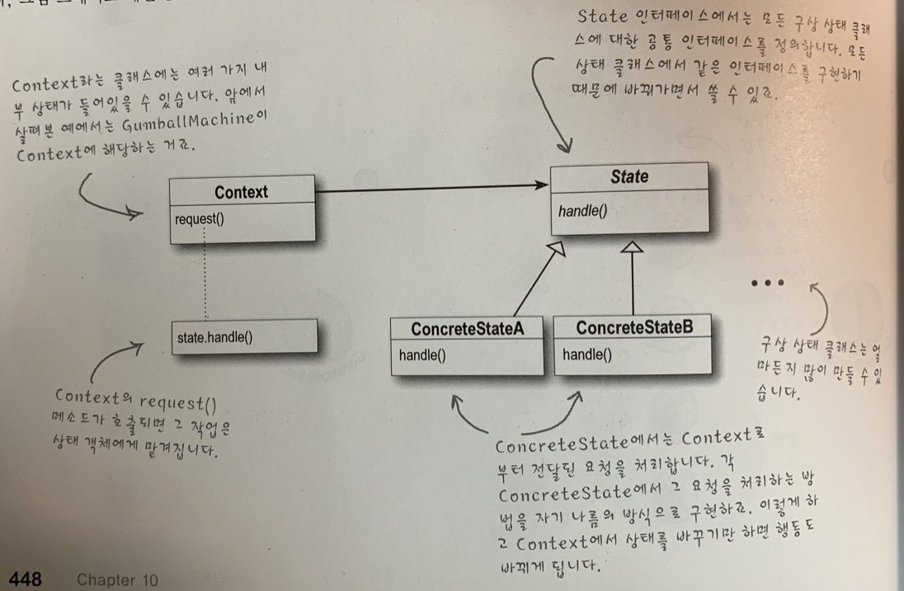

# State

내부 상태를 바꿈으로써 객체에서 행동을 바꾸는 것을 도와줌

```text
스테이트 패턴을 이용하면 객체의 내부 상태가 바뀜에 따라서 객체의 행동을 바꿀 수 있다. 마치 객체의 클래스가 바뀌는 것과 같은 결과를 얻을 수 있다.
```

- 상태를 별도의 클래스로 캡슐화한 다음 현재 상태를 나타내는 객체에게 행동을 위임
  - 내부 상태가 바뀜에 따라서 행동이 달라지게 된다
- 구성을 통해서 여러 상태 객체를 바꿔가면서 사용하기 때문에 클래스가 바뀌는 것 같은 결과를 얻는다




## 상태 패턴 vs 전략 패턴
- 다이어그램 동일

### 상태 패턴
- 상태 객체에 일련의 행동이 캡슐화됨
- 상황에 따라 Context 객체에서 여러 상태 객체 중 한 객체에게 모든 행동을 위임
- 클라이언트는 상태 객체에 대해서 거의 아무것도 몰라도 됨
- **수많은 조건문을 집어넣는 대신**에 사용할 수 있는 패턴
- 행동을 객체 내에 캡슐화시키면 컨텍스트 내의 상태 객체를 바꾸는 것만으로도 컨텍스트 객체의 행동을 바꿀 수 있음
- Context 객체를 생성할 때 초기 상태를 지정해주는 경우는 있지만, 그 후로는 그 Context 객체가 알아서 자기 상태를 변경

### 전략 패턴
- 일반적으로 클라이언트에서 컨텍스트 객체한테 어떤 전략 객체를 사용할지를 지정해줌
- 보통 가장 적합한 전략 객체를 선택해서 사용
- **서브클래스를 만드는 방법을 대신**하여 유연성을 극대화하기 위한 용도
- 전략 패턴을 사용하면 구성을 통해 행동을 정의하는 객체를 유연하게 변경 가능
- 어떤 클래스의 인스턴스를 만들고 그 인스턴스에게 어떤 행동을 구현하는 전략 객체를 건네 줌

## 핵심 정리
- 스테이트 패턴을 이용하면 내부 상태를 바탕으로 여러 가지 서로 다른 행동을 사용할 수 있다.
- 프로시저형 상태 기계를 쓸 때와는 달리 각 상태를 클래스를 이용해 표현하게 된다.
- Context 객체에서는 현재 상태에게 행동을 위임한다.
- 각 상태를 클래스로 캡슐화함으로써 나중에 변경시켜야 하는 내용을 국지화할 수 있다.
- 스테이트 패턴과 스트래티지 패턴의 클래스 다이어그램을 똑같지만 그용도는 서로 다르다
- 스트래티지 패턴에서는 일반적으로 행동 또는 알고리즘을 Context 클래스를 만들 때 설정한다.
- 스테이트 패턴을 이용하면 Context의 내부 상태가 바뀜에 따라 알아서 행동을 바꿀 수 있도록 할 수 있다.
- 상태 전환은 State 클래스에 의해서 제어할 수도 있고, Context 클래스에 의해서 제어할 수도 있다.
- 스테이트 패턴을 이용하면 보통 디자인에 필요한 클래스의 개수가 늘어난다.
- State 클래스를 여러 Context 객체의 인스턴스에서 공유하도록 디자인할 수도 있다.