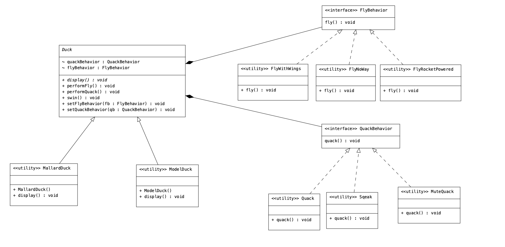

# Strategy pattern

`스트래티지 패턴`에서는 알고리즘군을 정의하고 각각을 캡슐화하여 교환해서 사용할 수 있도록 만든다.  
스트래티지를 활용하면 알고리즘을 사용하는 클라이언트와는 독립적으로 알고리즘을 변경할 수 있다.

# 1. 객체지향의 기초. 4대 특성
1. 추상화
   - 어떤 실체로부터 공통적인 부분이나 관심있는 특성들만 한 곳에 모은 것을 의미한다.
   - 관심이 없는 것은 무시
2. 캡슐화
   - 비슷한 역할을 하는 속성과 메서드들을 하나의 클래스로 모은 것을 캡슐화라고 한다. 캡슐화에 속한 개념으로 정보 은닉이라는 것이 있는데, 캡슐 내부의 로직이나 변수들을 감추고 외부에는 기능만을 제공하는 것을 의미한다.
3. 다형성
   - 같은 모양의 함수가 상황에 따라 다르게 동작하는 것을 의미.
4. 상속
    - 클래스를 재사용하는 것. 상위 클래스를 하위 클래스에서 상속 받게 되면 상위 클래스의 멤버 변수나 메서드를 그래도 물려 받을 수 있음. 상속이 있기 때문에 코드를 재활용할 수 있고 그렇게 때문에 생산성이 높고 유지보수 하기가 좋다. 
    - 정말??? 변화가 많은 클래스의 경우에는 하위 클래스 별로 변경 로직을 일일이 코드해야 하는 경우가 발생할 수 있음. 이러한 경우 코드의 중복이 발생할 수 있으며, 유지보수를 더 어렵게 만들 수 있다.
    - 상속 대신 Composition을 활용하는 Strategy Pattern을 적용하면 상속의 단점을 보완할 수 있음 

# 2. 디자인 원칙
1. 바뀌는 부분은 `캡슐화`한다.
    - 코드를 변경하는 과정에서 의도하지 않은 일이 발생하는 것을 줄이면서 시스템의 유연성과 확장성은 향상시킬 수 있음
2. 상속보다는 `구성(composition)`을 활용한다.
   - 구성 사용 시 장점
    1. 유연성 향상 : 실행시 행동을 바꿀 수 있음
    2. 알고리즘을 별도의 클래스의 집합으로 캡슐화
3. 구현이 아닌 인터페이스에 맞춰서 프로그래밍한다.
    - ***상위 형식에 맞춰서 프로그래밍한다***는 것을 뜻함
      + 변수를 선언할 때는 *보통 추상 클래스*나 *인터페이스* 같은 *상위 형식*으로 선언해야 한다. 객체를 변수에 대입할 때 상위 형식을 구체적으로 구현한 형식이라면 어떤 객체든 집어넣을 수 있기 때문이다. 그렇게 하면 변수를 선언하는 클래스에서 실제 객체의 형식을 몰라도 된다.
    - 자바의 interface를 반드시 사용하라는 의미가 아님
    - 실제 실행시에 쓰이는 객체가 코드에 의해서 고정되지 않도록, 어떤 상위 형식(supertype)에 맞춰서 프로그래밍함으로써 다형성을 활용해야 한다는 것
    

### 관계
1. A는 B이다
    - is-a 관계
    - Generalization(일반화)
    - 상속 관계
2. A에는 B가 있다
    - has-a
    - Composition
3. A가 B를 구현한다.
    - implements
    - interface