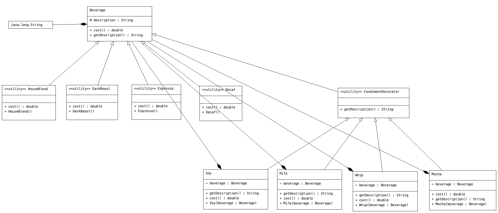

# Decorator

`데코레이터 패턴`에서는 객체에 추가적인 요건을 동적으로 첨가한다. 데코레이터는 서브 클래스를 만드는 것을 통해서 기능을 유연하게 확장할 수 있는 방법을 제공한다.

객체에 추가 요소를 동적으로 더할 수 있음. 데코레이터를 사용하면 서브 클래스를 만드는 경우에 비해 훨씬 유연하게 기능을 확장할 수 있다.

## 데코레이터 패턴 구성요소

1. 추가 구성요소 (Beverage)
2. 구상 구성요소 (HouseBlend)
3. 추상 데코레이터 (CondimentDecorator)
4. 구상 데코레이터 (Whip)

## 데코레이터 적용 예 : 자바 I/O

java.io 패키지 상당 부분이 데코레이터 패턴

## 데코레이터 패턴 단점

- 잡다한 클래스들 다수 발생 가능성 존재
- 특정 형식에 의존하는 코드에 데코레이터 적용 시 문제 발생
- 데코레이터 도입 시 구성 요소 초기화하는 데 필요한 코드가 훨씬 복잡해짐

`팩토리`와 `빌더`패턴을 통해 데코레이터 패턴의 단점 보완 가능

## OCP (Open-Closed Principle)

> 클래스는 확장에 대해서는 열려 있어야 하지만 코드 변경에 대해서는 닫혀 있어야 한다.

기존 코드는 건드리지 않은 채로 확장을 통해서 새로운 행동을 간단하게 추가할 수 있도록 하는게 목표.

무조건 OCP를 적용하는 것은 시간 낭비가 될 수도 있고, 괜히 쓸 데 없는 일을 하는 것일 수도 있음. `가장 바뀔 확률이 높은 부분`을 중점적으로 살펴보고 원칙을 적용하는
방법이 가장 현명.

## 핵심정리

- 상속을 통해 확장을 할 수도 있지만, 디자인의 유연성 면에서 적절치 않음
- 기존 코드를 수정하지 않고도 행동을 확장하는 방법이 필요
- `구성`과 `위임`을 통해서 실행중에 새로운 행동을 추가할 수 있음
- 상속 대신 `데코레이터 패턴`을 통해 행동을 확장할 수 있음
- 데코레이터 패턴에서는 구상 구성요소를 감싸주는 `데코레이터`들을 사용
- 데코레이터 클래스의 형식은 그 클래스가 감싸고 있는 클래스의 형식을 반영 (상속 또는 인터페이스 구현을 통해서 자신이 감쌀 클래스와 같은 형식을 가지게 됨)
- 데코레이터에서는 자기가 감싸고 있는 구성요소의 메소드를 호출한 결과에 새로운 기능을 더함으로써 행동을 확장
- 구성요소를 감싸는 데코레이터의 개수에 제한 없음
- 구성요소의 클라이언트 입장에서는 데코레이터의 존재를 알 수 없음. 단, 클라이언트에서 <u>구성요소의 구체적인 형식에 의존</u>하게 되는 경우는 예외.
- 데코레이터 패턴 사용 시 자잘한 객체들이 매우 많이 추가될 수 있고, 데코레이터를 너무 많이 사용하면 코드가 필요 이상으로 복잡해질 수도 있음.